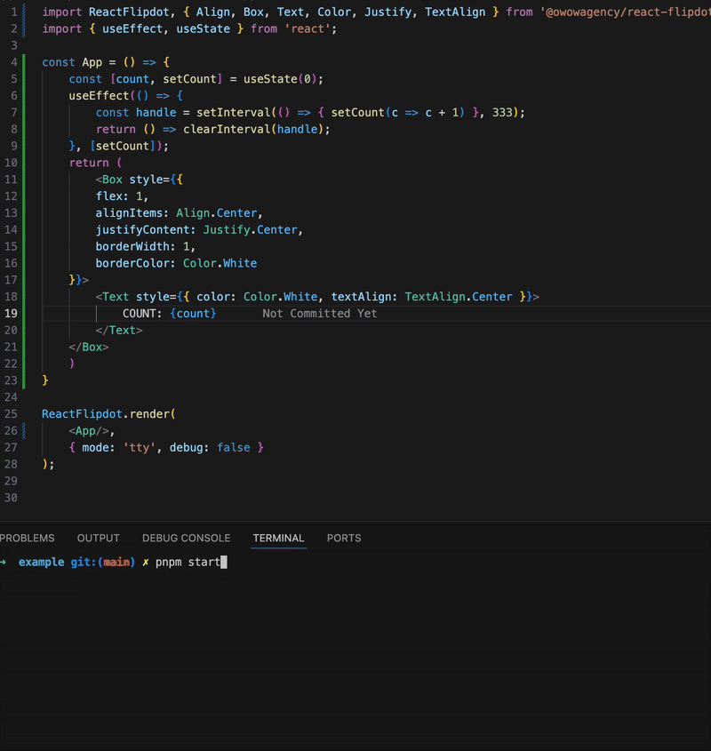

# React Flipdots

## Sample



```tsx
import ReactFlipdot, { Align, Box, Text, Color, Justify, TextAlign } from '@owowagency/react-flipdot';

ReactFlipdot.render(
    <Box style={{
        flex: 1,
        alignItems: Align.Center,
        justifyContent: Justify.Center,
        borderWidth: 1,
        padding: 1,
        borderColor: Color.White
    }}>
        <Text style={{ color: Color.White, textAlign: TextAlign.Center }}>
            EXAMPLE
        </Text>
    </Box>,
    { mode: 'tty', debug: false }
);
```

Change `mode: 'tty'` to `mode: 'flipdots'` to switch renderer from terminal to flipdots

## Building

```shell
# Build all
pnpm build
# Build packages
pnpm build:watch
# Build types
pnpm build:types:watch
```

## Flipdot emulator

See [flipdot-emu](./packages/flipdot-emu/README.md)

## Apps

```shell
cd apps/countdown
# Start with 'tty' as a rendering backend
pnpm start
# Start with 'flipdot' as a rendering backend
pnpm start:flipdot
```